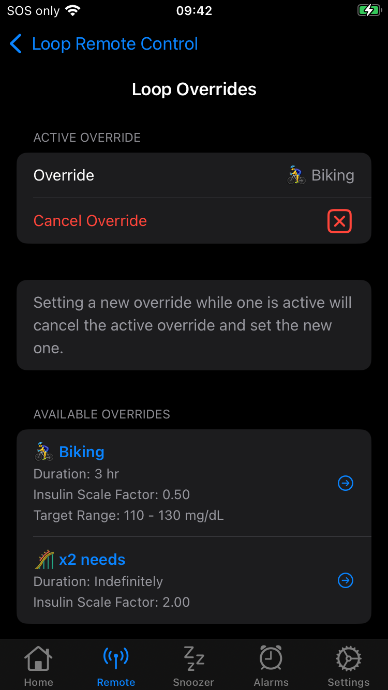

🚧 Documentation Under Construction 🚧

## Remote Control with Nightscout

You must configure *LoopFollow* and the *Nightscout* URL to use remote commands. 
Please review the [Remote Control Overview](remote-control-overview.md) if terms on this page are not familiar.

* *Nightscout* Remote Command in *LoopFollow* makes the standard Careportal options easily available from inside the *LoopFollow* app
    * With this selection, the *LoopFollow* phone sends commands to *Nightscout* which then sends commands to the *Loop*/*Trio* phone
    * For that reason, the *Nightscout* display will be updated first
        * If there is an issue sending the careportal request from *Nightscout*, it might not make it to the *Loop*/*Trio* phone
        * After the next download from *Nightscout*, the display will update if commands do or do not make it through the full round trip

Please read the appropriate section on this page.

* [*LoopFollow* & Careportal with the *Loop* App](#loopfollow-careportal-with-the-loop-app)
* [*LoopFollow* & Careportal with the *Trio* App](#loopfollow-careportal-with-the-trio-app)

- - -

## *LoopFollow* & Careportal with the *Loop* App

For *Loop* careportal access, your *Nightscout* site must be configured with Apple Push Notification System (APNS) credentials as fully explained in LoopDocs.

* [*LoopDocs*: Remote Overview](https://loopkit.github.io/loopdocs/nightscout/remote-overview/)

Then once you add the Nightscout URL with at least a careportal token to *LoopFollow* and choose *Nightscout* for the *LoopFollow* Remote Settings, you have the option to set or cancel overrides for the *Loop* app. 

The graphic below shows what the screen looks like when you tap the `Remote` option from the toolbar of *LoopFollow*.

{width="300"}
{align="center"}

At least one override (or saved preset) must be uploaded from the *Loop* phone to *Nightscout* before this option works.

{width="300"}
{align="center"}

Only one override can be active at a time. If one is active, you can cancel it. Or if you want to change overrides, you can select a new one, which automatically cancels the old one.

- - - 

## *LoopFollow* & Careportal with the *Trio* App

!!! warning "Important"
    The ability for the *Trio* app to be remotely controlled will be **disabled** when `Enable Remote Control` is turned OFF on the *Trio* phone, even if you have given *LoopFollow* your *Nightscout* URL with Careportal access. This is for the protection of the *Trio* user, so that they **always** are the primary controller of their insulin dosing app.

    For more details, see [*Trio* Remote Control](remote-control-overview.md#trio-remote-control){: target="_blank" }.

Trio can accept remote commands from *Nightscout* or from *LoopFollow*. There are a variety of options, but the final control of whether remote commands will be enacted rests with the Trio user. They can enable or disable remote control.

The use of remote control with *Nightscout*, for entry of Carb Correction and Temporary Targets when Careportal is authenticated, is available with *Trio* 0.2.x and newer and *LoopFollow* 2.4.0 and newer. However, the *LoopFollow* implementation only supports Temp Target start and cancel.

| *Nightscout* URL or App | Options|
|:--|:--|
| ***Careportal*** | Carb Correction Temporary Target Temporary Target Cancel |

🚧 Graphics Under Construction 🚧

If you select *Nightscout* as the Remote Control Type for *LoopFollow*, this enables Temporary Targets to be set and disabled from *LoopFollow*.

> This is the only remote option that works for *Trio* 0.2.x when using *LoopFollow*.

{width="300"}
{align="center"}

- - -
